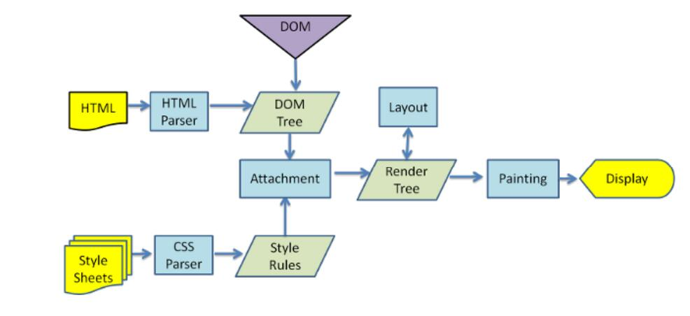
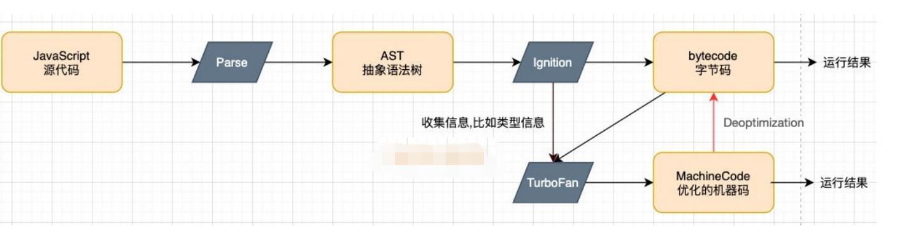
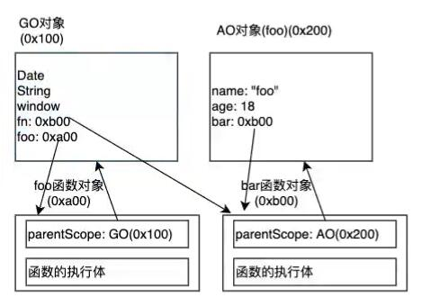
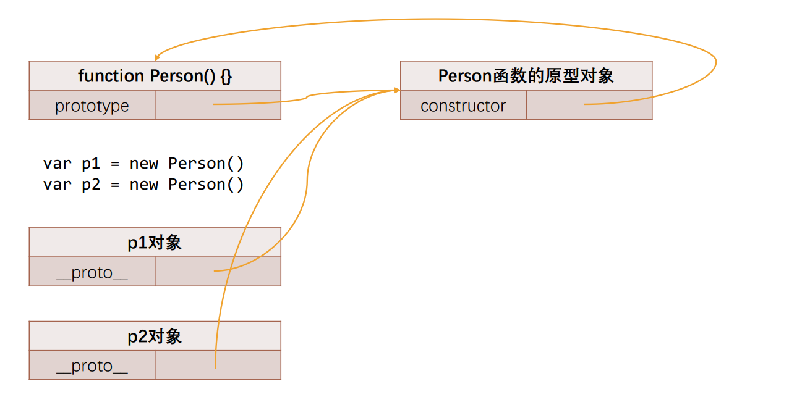
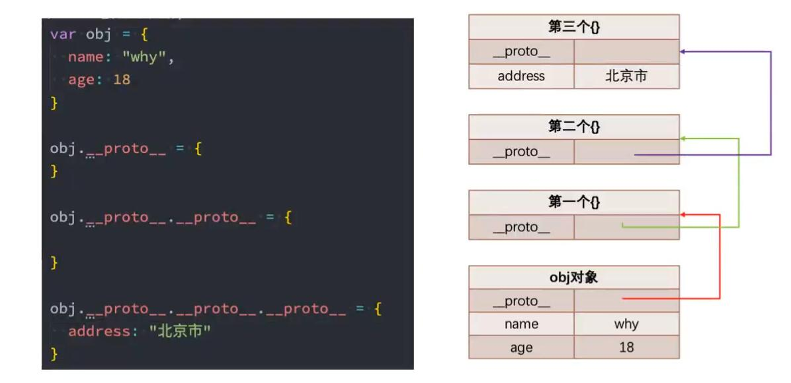
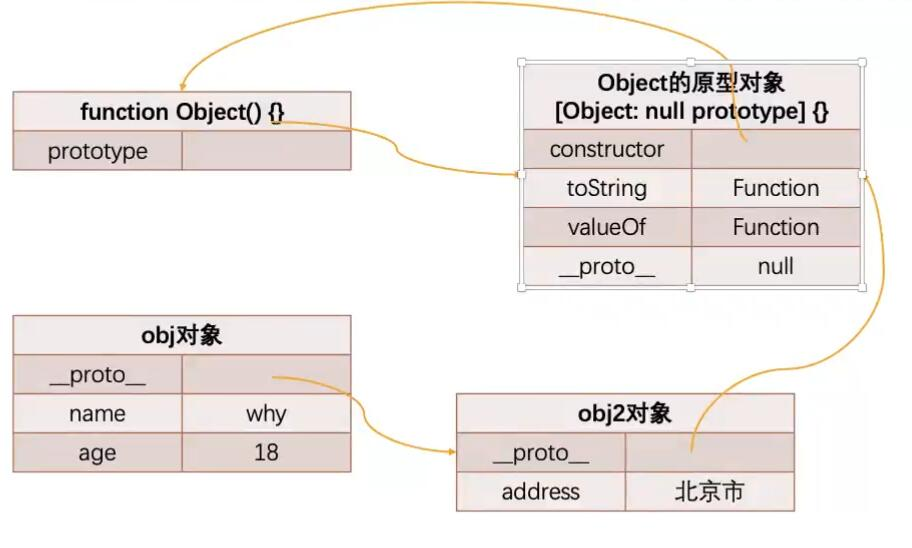
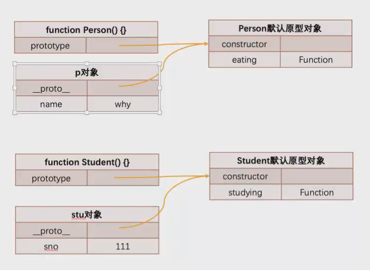
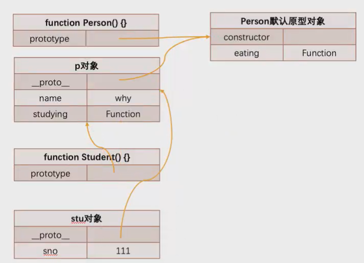

# javascript高级语法

## 01-浏览器执行原理

### 浏览器内核

浏览器引擎也叫，排版引擎，页面渲染引擎，样板引擎

Trident，IE以前用的现在web Bink

webkit，苹果safari，google

Blink,webkit分支

### 浏览器渲染过程 

渲染过程如图：

1.先请求html，HTML Parser执行，将html转成DOM树

2.请求css，使用css parser，生成css规则，将其和DOM树结合在一起

3.render tree（layout）什么位置

4.painting绘制



### V8引擎原理

由C++编写，实现ECMAscript和Webassembly

流程：js代码解析--->生成抽象语法树--->ignition（解释器）--->转化成字节码

turboFan：对执行函数多次，会打上印记hot，优化MachineCode



### 代码执行

代码解析，创建全局Object，堆内存

运行代码,创建一个上下文栈（函数调用栈）

全局上下文维护着VO（variable object）（指向GO）

执行代码，例如var a = 9，通过vo找到go修改全局对象，先开始为var a = undefined，然后进行修改，9赋值给a

## 02-函数执行-作用域链

### 函数执行

```javascript
//编译阶段，发现是个函数，堆内存创建这个函数，[[scope chain]] 和函数代码体，将内存地址
//赋值---foo：0xa101
foo()
function foo () {
	console.log("foo run")
}
```

### 查找顺序

作用域链：当前对象的VO+Parent Scope(父级作用域)

Parent Scope(父级作用域)，编译时候确定（！！！）

在当前VO找不到，去上层作用域找

```javascript
//查找顺序，沿着作用域链查找
var name = "wzx"
foo()
function foo () {
	console.log("foo run",name)
}
//寻找name，从函数对象，VO里面去寻找也就是AO，作用域链
//执行完成，从函数调用栈移除
```

#### 多层嵌套函数

函数嵌套函数，如果该开始不立即执行，则不需要编译，做预编译

```javascript
foo(123)
function foo (num) {
    var name = "wzx"
    var sex = "nan"
	function bar () {
		console.log("bar执行")
	}
    bar()
}
//foo的VO对象 num,name,sex,函数参数属于自己的vo对象
//执行顺序，外层函数执行，压入栈
//内部函数执行完，依次弹出
```

#### 作用域链

```javascript
var message = "window"
function foo() {
    var message = "foo"
    bar()
}
function bar() {
    console.log(message);
}
foo()
//执行创建全局对象
message：undefined
foo：0Xa00
//foo对象
message：undefined
bar：0xb10
//bar对象


```

### 作用域提升面试题

例1

```javascript
var n =100 
//定义位置，父级作用域为全局
function foo (){
	n=200
}
foo()
console.log(n)
//200
```

例2

```javascript
function foo (){
    //undefined,自己存在
	console.log(n)
	var n = 200
    //200
	console.log(n)
}
var n = 100
foo()
```

例3

```javascript
var n=100
function foo1() {
    //自己不存在，找全局的
	console.log(n)
}
function foo2(){
	var n =200
    //自己的
	console.log(n)
    foo1()
}
foo1()
foo2()
//全局
console.log(n)// 100
```

例4

```javascript
var a = 100
function foo (){
    //undefined
	console.log(a)
    //运行时return
	return
	var a= 200
}
```

例5

```javascript
function foo10 (){
	var m = 100
}
foo10()
//找不到
console.log(m)
```

例5

```javascript
function foo11(){
	var a = b = 10
	//相当于
	var a = 10
	b=10
}
```

### 内存管理

1.申请分配内存

2.使用分配内存，存储对象

3.释放内存

基本数据类型：栈空间

引用类型：内存堆

## 03-闭包

### 定义

函数+访问的自由变量

1.闭包，又称词法闭包(Lexical Closure )或函数闭包( function closures ) 

2.是在支持头等函数的编程语言中，实现词法绑定的一种技术;

3.闭包在实现上是一个结构体，它存储了一个函数和一个关联的环境（相当于一个符号查找表）;

4.闭包跟函数最大的区别在于，当捕捉闭包的时候，它的自由变量会在补充时被确定，这样即使脱离了捕捉时的上下文，它也能照常运行;

### 案例

```javascript
function foo() {
    var name = "a"
    function bar() {
        console.log("bar", name)
    }
    return bar
}
var fn = foo()
fn

//开始执行
//创建全局GO，有名变量赋值undefined，函数分配内存地址
//从上往下执行
//foo函数执行
//name 赋值，bar函数创建对象
//return，foo函数代码体执行完毕，从函数调用栈弹出
//fn赋值为 bar函数
//bar函数执行
//bar函数找到name，通过作用域链，找到定义上下文的name为foo的name

//本来foo函数执行完了销毁，但是没有销毁，仍能访问里面的变量
```

#### 内存泄漏案例

```javascript
function foo (){
	var name= "wzx"
	var sex = "men"
	function bar (){
		console.log(name,sex)
	}
	return bar
}
var fn = foo()
fn()
//全局对象属性fn引用着bar函数，bar函数引用着foo函数对象
//解决foo=null，fn=null
```



## 04-this指向 

全局作用域指向window，node环境，指向{}

this与调用位置，调用方式有关，运行时绑定

### 规则一：默认绑定

独立函数调用，函数没有绑定到某个对象上调用

```javascript
//---------1.
function foo() {
    console.log(this);
}
function bar() {
    console.log(this);
}
function zoo() {
    bar()
}
zoo()

//---------2.
var obj = {
    say() {
        console.log(this);
    },
    he: zoo
}
var fn = obj.say()
fn()


//---------3
function aaa() {
    function haha() {
        console.log(this);
    }
    return haha
}
var bbb = aaa()
bbb()
```

### 规则二：隐式绑定

某个对象发起调用，调用位置，是通过某个对象发起的函数调用

对象会被自动的被js引擎绑定到函数的this上

前提:调用对象内部必须有一个函数的引用(例如属性)

```javascript
//---------1.
function foo (){
	console.log(this)
}

//foo()
//独立函数调用


var obj = {
	name:"obj"
    foo:foo
}
//隐式绑定，绑定到obj上
obj.foo()

//---------2.
var obj = {
	name:"obj1",
    foo(){
    	console.log(this.name)
    }
}
var obj2 = {
	name:"obj2",
    bar:obj1.foo
}
obj2.bar()
```

### 规则三：显示绑定

不希望函数在这个对象上，但是希望是这个对象调用

call,apply,bind

明确指定调用对象

```javascript
//call,参数列表
//apply,数组
```

```javascript
//---------1.
function foo () {
	console.log("wz")
}

//直接调用不绑定，指向window
foo.call()---foo.apply()


//---------2.
function foo () {
	console.log(this)
}
foo.call("str")
foo.call(obj)

//---------call与apply区别.
function foo (a,b) {
	console.log(this,a+b)
}
foo.call(obj,20,30)
foo.apply(obj,[20,30])


//---------bind.不用多次绑定
function bar () {
	console.log(this)
}
var fn = bar.bind("haha")
fn()//"haha"
fn()//"haha"
```

### 规则四：new绑定

```javascript
//我们通过一个new关键字调用一个函数时(构造器)，这个时候this是在调用这个构造器时创建出来的对象
//this = 创建出来的对象
//这个绑定过程就是new绑定
```

```javascript
function person(name, age) {
    this.name = name
    this.age = age
    return this
}
var p = new person()

//
 var obj = {
            name:"a",
            foo:function (){
                var name = "b"
                this.name = "c"
                console.log(this,this.name)
            }
        }
        new obj.foo()//"c"
```

### this优先级

默认绑定规则最低

显示绑定高于隐式绑定

new 绑定高于隐式绑定

new --->显示--->隐式--->默认 

```javascript
//显示绑定高于隐式绑定
function foo (){
	console.log(this)
}
var obj = {
	bar:foo.bind("aaa")
}
obj.foo()//"aaa"

//new高于隐式绑定

```

### 箭头函数

不绑定this，根据外层作用域决定this

```javascript
//普通匿名函数
var obj = {
	arr:[]
    sum(){
    var _this = this
		setTimieout(function(){
		_this.arr.push(1)
		},1000)
	}
}

//箭头函数
var obj = {
	arr:[]
    sum(){
    var _this = this
		setTimieout(()=>{
		this.arr.push(1)
		},1000)
	}
}
```

### 面试题（一）

```javascript
var name = "window";

var person = {
  name: "person",
  sayName: function () {
    console.log(this.name);
  }
};

function sayName() {
  var sss = person.sayName;
  sss(); //window，独立默认调用
  person.sayName();//隐式，对象调用
  (person.sayName)();//隐式，对象调用
  (b = person.sayName)(); //赋值表达式，window
}

sayName();
```

### 面试题（二）

```javascript
var name = 'window'

var person1 = {
    name: 'person1',
    foo1: function () {
        console.log(this.name)
    },
    foo2: () => console.log(this.name),
    foo3: function () {
        return function () {
            console.log(this.name)
        }
    },
    foo4: function () {
        return () => {
            console.log(this.name)
        }
    }
}

var person2 = { name: 'person2' }

 person1.foo1(); //隐式，对象调用,person1
 person1.foo1.call(person2); //显示绑定，person2

 person1.foo2(); //window，对象没作用域
 person1.foo2.call(person2); //window，对象没作用域

 person1.foo3()();//独立函数调用，person1.foo3()拿到结果
 person1.foo3.call(person2)(); //window，独立函数调用
 person1.foo3().call(person2); //person2，显示绑定

 person1.foo4()(); //箭头函数不绑定this，person1
 person1.foo4.call(person2)();//上层函数被绑定一个person2，箭头函数继承person2
 person1.foo4().call(person2);//不绑定，person1
```

### 面试题（三）

```javascript
var name = 'window'

function Person (name) {
  this.name = name
  this.foo1 = function () {
    console.log(this.name)
  },
  this.foo2 = () => console.log(this.name),
  this.foo3 = function () {
    return function () {
      console.log(this.name)
    }
  },
  this.foo4 = function () {
    return () => {
      console.log(this.name)
    }
  }
}

var person1 = new Person('person1')
var person2 = new Person('person2')

person1.foo1() //person1
person1.foo1.call(person2)// person2

person1.foo2() //person1
person1.foo2.call(person2)//person1,上层

person1.foo3()() //window
person1.foo3.call(person2)()//window
person1.foo3().call(person2) //person2

person1.foo4()() //person1，上层
person1.foo4.call(person2)() //上层是person2，
person1.foo4().call(person2) //上层person1


var obj = {
  name: "obj",
  foo: function() {

  }
}
```

### 面试题（四）

```javascript
var name = 'window'

function Person (name) {
  this.name = name
  this.obj = {
    name: 'obj',
    foo1: function () {
      return function () {
        console.log(this.name)
      }
    },
    foo2: function () {
      return () => {
        console.log(this.name)
      }
    }
  }
}

var person1 = new Person('person1')
var person2 = new Person('person2')

person1.obj.foo1()() 
person1.obj.foo1.call(person2)() 
person1.obj.foo1().call(person2) 

person1.obj.foo2()() 
person1.obj.foo2.call(person2)() 
person1.obj.foo2().call(person2) 

 

 var obj = {
   name: "obj",
   foo: function() {
     // 上层作用域是全局
   }
 }

 function Student() {
   this.foo = function() {

   }
 }
```

## 05-apply，call，bind实现

### call方法

```javascript
Function.prototype.calldemo = function (thisArg, ...params) {
    //this，指向当前函数
    var fn = this
    //自己调用，执行，相当于没传参数
    fn()
    thisArg = thisArg ? Object(thisArg) : window
    //传入要绑定对象，上面添加属性为fn（当前的fn）
    thisArg.thisfn = fn
    //隐式绑定，参数调用这个fn
    var res = thisArg.thisfn(...params)
    return res
}
```

### apply方法

```javascript
Function.prototype.applydemo = function (thisArg, params) {
    //this，指向当前函数
    var fn = this
    //自己调用，执行，相当于没传参数
    fn()

    thisArg = thisArg ? Object(thisArg) : window
    //传入要绑定对象，上面添加属性为fn（当前的fn）
    thisArg.thisfn = fn
    //隐式绑定，参数调用这个fn
    params = params || []
    var res = thisArg.thisfn(...params)
    return res
}
```

### bind方法

```
Function.prototype.bindDemo = function (thisArg, ...argwarap) {
    var fn = this
    function proxyFn(...args) {
        thisArg.fn = fn
        var result = thisArg.fn(...argwarap, ...args)
        return result
    }
    return proxyFn
}
```

### arguments对象

```javascript
1.arguments.length			//参数长度
2.arguments[1]			    //根据索引获取值
3.arguments.callee			//获取当前函数的参数
```

## 06-纯函数、柯里化

#### 纯函数

1.确定的输入，一定会产生确定的输出

2.不会产生副作用（修改全局变量，修改参数，）

#### 柯里化

概念:接受多个参数的函数，转化为接受一个参数的结果

```javascript
简单例子：
function fn (a) {
	return (b) =>{
		return a+b
	}
}
```

## 07-面向对象

概念:属性的无序集合 	-key是一个标识符的名称，value是任意类型

#### 属性描述符

```javascript
const obj = {
    name: "hello"
}
//单个属性
Object.defineProperty(obj, "name", {
    //可删除，可修改？？？
    configurable: true,
    //值
    value: "world",
    //是否枚举
    enumerable: true,
    //是否可修改
    writable: true,
    get: function () {
        return "getter方法"
    },
    set: function () {
        this.name = "setter方法"
    }
})
//多个属性
Object.defineProperty(obj,{
    name:{
    	writable: true,
    },
    age:{
    	  value: "world",
    }
})
```

```javascript
//阻止对象扩展，添加新属性
Object.preventExtensions(obj)
//禁止对象配置/删除属性
Object.seal(obj)
//不可修改
Object.freeze(obj)
```

#### new操作符

```javascript
function person ( name ) {
	this.name = name
}
const obj = new person()
```

## 08-原型和原型链

#### 原型

每个对象都有一个[[prototype]]（原型）

```javascript
//创建一个对象，并且浏览器添加一个原型对象赋值为{}
var obj = {name:"hello",__proto__:{}}
```

##### 原型作用

```javascript
//当我们从对象中获取值，触发get操作
//1.先从当前自身上找，找到就使用
//2.没找到，从原型上去找
var obj = {
	name:"gaga"
}
//没有age
console.log(obj.age)//err
//原型上添加
obj.__proto__.age = 20
console.log(obj.age)//ok
```

### 函数的原型

```javascript
//函数除了__proto__（也就是[[prototype]]===隐式原型），还有prototype（显示原型）
function foo (){
	
}
console.log(foo.prototype)//{}
```

#### __proto与prototype关系

```javascript
//内部操作,new关键字
function foo () {
	var obj = {}
    this = {}
    this.__proto__ = foo.prototype
}
const p1 = new foo()
const p2 = new foo()
p1.__proto__ === foo.prototype
p2.__proto__ === foo.prototype
```

#### 函数的构造函数

```javascript
function bar () {
	
}
const p1 = new Bar()
const p2 = new Bar()
```



#### 属性查找顺序

```javascript
function bar () {}
const p1 = new Bar()
p1.name
//自身属性上找，未找到，原型去寻找

//方法一：
p1.__proto__.name="hello"
//相当于在p1的__proto__，上添加name属性，并且指向prototype上也有name属性
```

#### 原型对象

每个函数的prototype都有一个属性constructor

```javascript
function foo () {}
foo.prototype.constructor ===（指向函数本身） foo
```

#### 重写prototype

```javascript
function foo () {}
foo.prototype = {
	//指向函数本身
	constructor:foo,
	name:"hell",
    sex:"men"
}
//使constructor不可枚举
Object.defineProperty(foo.prototype,"constructor",{
	enumerable:false,
    configurable:true
})
```

### 原型链



```javascript
var obj = {
    name: "why",
    age: 18
}

//[[get操作]]
//当前对象查找属性
//没找到，从原型上去找,原型链__proto__

obj.__proto__ = {}
console.log(obj.address);

//原型对象上也有原型对象

//也有对应的原型对象
// obj.__proto__ = {
//     __proto__: {}
// }
obj.__proto__.__proto__ = {
    sex: "men"
}
console.log(obj.sex);
```

##### 顶层原型

从Object上创建的对象原型都是[Object:null prototype] { }

[Object:null prototype] { }对象特殊点

1、该对象上有原型属性，但是指向为null

2、该对象上有很多的默认方法

```javascript
//顶层原型Object
var obj = new Object()
function foo (){}
var f1 = new foo()

//1、创建内存区域
//2、创建空对象，将其赋值给this
//3、空对象的__proto__ = Object.prototype
//4、返回这个对象

var obj = {
	name:"why",
    age:18
}
var obj2 = {
 address:"hell"
}
obj.__proto__ = obj2

//console.log(obj.address)
//以下查找顺序
```



### 继承

#### 简单继承

```javascript
//顶层父类
function Person() {
    this.name = "hell"
}
Person.prototype.run = function () {
    console.log(this.name + 'run');
}
//子类
function Student() {
    this.sn = "111"
}

var p = new Person()
//原型赋值
Student.prototype = p

Student.prototype.eat = function () {
    console.log(this.sn + 'eat');
}
var stu = new Student()
```

如图所示

```javascript
//没有Student.prototype = p，情况
```



```javascript
//有Student.prototype = p，情况
```



以上方法缺陷：

```javascript
1.有些属性看不到
console.log(stu)
//person {sn:"111"}，继承的属性无法看到
2.修改对象上的属性，不会影响，----获取引用修改，会相互影响
stu.sex="men"//相当于给本对象添加属性，不会从原型上添加
```

#### 构造函数继承

```javascript
//顶层父类
function Person(name) {
    this.name = "hell"
}
Person.prototype.run = function () {
    console.log(this.name + 'run');
}
//子类
function Student(name) {
    //student调用person，Person函数this就是指向student，把person的属性弄到本身上去
    Person.call(this, name)

    this.sn = "111"
}
Student.prototype = Person.prototype
Student.prototype.eat = function () {
    console.log(this.sn + 'eat');
}
var stu = new Student()
var stu = new Student()
```

#### 原型式继承

```javascript
var obj = {
    name: "hello",
    age: "pengpeng"
}
//1.原型式继承函数
function createObject(o) {
    var obj = {}
    Object.setPrototypeOf(obj, o)
    return obj
}

//2。原型式继承函数
function createObject2(o) {
    function fn() { }
    fn.prototype = o
    return new fn()
}

//Object.create() 方法用于创建一个新对象，使用现有的对象来作为新创建对象的原型（prototype）。
var newInfo = Object.create(obj)

var info = createObject(obj)
console.log(info);
console.log(info.__proto__);
```

#### 寄生式继承

```javascript
var obj = {
    sex: "men"
}
function createObj(name, age) {
    var newObj = Object.create(obj)
    newObj.name = name
    newObj.age = age
}
var stu = createObj("he", 20)
var stu2 = createObj("he1", 21)
```

### 原型相关方法

**`Object.create()`** 方法用于创建一个新对象，使用现有的对象来作为新创建对象的原型（prototype）

```javascript
var info = Object.create(obj, {
    address: {
        writable: true,
        enumerable: true
    },
    phone: {
        writablet: true,
        configurable: true
    }
})
```

**`hasOwnProperty()`** 方法会返回一个布尔值，指示对象自身属性中是否具有指定的属性（也就是，是否有指定的键）。

```javascript
var obj = {
    name: "he",
    sex: "men"
}

var info = Object.create(obj, {
    address: {
        writable: true,
        enumerable: true
    },
    phone: {
        writablet: true,
        configurable: true
    }
})


console.log(info.hasOwnProperty("name"));
console.log(info.hasOwnProperty("address"));
```

**`instanceof`** **运算符**用于检测构造函数的 `prototype` 属性是否出现在某个实例对象的原型链上。

```javascript
function Car(make, model, year) {
  this.make = make;
  this.model = model;
  this.year = year;
}
const auto = new Car('Honda', 'Accord', 1998);

console.log(auto instanceof Car);
//  output: true

console.log(auto instanceof Object);
// output: true
```

**`isPrototypeOf()`** 方法用于测试一个对象是否存在于另一个对象的原型链上。

```javascript
function Foo() {}
function Bar() {}
function Baz() {}

Bar.prototype = Object.create(Foo.prototype);
Baz.prototype = Object.create(Bar.prototype);

var baz = new Baz();

console.log(Baz.prototype.isPrototypeOf(baz)); // true
console.log(Bar.prototype.isPrototypeOf(baz)); // true
console.log(Foo.prototype.isPrototypeOf(baz)); // true
console.log(Object.prototype.isPrototypeOf(baz)); // true
```

## 09-类使用

### 类创建

```javascript
//
class Perosn {

}
//表达式
var st = calss {
	
}
```

### 类的特点

```javascript
calss Person {
	//类构造方法只有一个
    //内存中创建一个对象
    //将类的原型赋值给这个新对象__porto__
    //将对象赋值给this
    //返回创建对象
    constructor(name,age){
    	this.name = "a"
        this.age = "b"
    }
    //实例方法
    ear(){
    	
    }
}
```

```
class Stu extends Person {
	constructor(name,age){
	//必须调用super关键字，调用父类构造函数
	super(name,age)//父类上
	//使用this
		this.name = name
		this.age =age
	}
}
```

## 10-ES6

#### 字面量增强语法

```javascript
var name = "hell"
var gae = "20"

var obj = {
	//对象的键和值刚好一样,属性简写
	name,
	age
}
```

#### 解构

##### 数组

```javascript
var [a,b,c] = ["aa","bb","cc"]
//解构所有
console.log(a,b,c)
//解构后两个
var [,d,f] = ["aa","bb","cc"]
//解构一个元素，剩下元素放到数组里去
var [a,...res] = ["aa","bb","cc"]
//解构默认值
var [a,b,c="hahah"] = ["aa","bb","cc"]
```

##### 对象

```javascript
var obj = {
	name:"haha",
	sex:"nan"
}

const { name,sex} = obj
const { name} = obj
//设置新名字
const { name:newName} = obj

//设置新名字赋值默认值
const {name:newName = "the new"} = obj
```

##### let-const

const 

```javascript
//基本值不可修改，引用可修改
const a = 1
a = 2//不允许
const obj = { name:"a"}
obj.name = "b"
//不可以重复定义
let a = 1
let a = 2
```

区别：var和let、const

var重复声明，let，const不能重复声明

var 作用域提升，let，const没有，但是被创建了，直到绑定求值才可以访问

var作用域（全局，函数），let、const块级作用域

#### Set

##### set

一般用于数组去重

```javascript
const set = new Set()
set.add(10)
set.add(10)//只会添加一个
```

#####  weakset

只能存放对象类型，不能存放基本类型

weakset对元素的引用是弱引用，如果没有其他对象对其引用，就会垃圾回收

强引用：正常的内存地址赋值，有引用GC不会回收掉

弱引用：有弱引用，GC认为可有可无，当没有强引用引用时，可以回收

```javascript
const weak = new WeakSet()
add//添加
delete//删除
has//是否存在
```

#### Map

存储映射关系

```javascript
const map = new Map()
//set设置键值对
map.set("name",1)
map.set("age",2)
//get传入键，获取值
map.get("name")
//delete
map.delete("name")
//has是否存在
map.has("name")
//clear
map.clear()

//也可以使用forEach
map.forEach((item,key)=>{
    //item为值，key为键
	console.log(item,key)
})

//for of 
for (item of map)
//item是数组，["name"(键),1(值)]
item[0](键),-------item[1](值)
```

##### weakMap

键只能存放对象类型，不能存放基本类型

weakMap对元素的引用是弱引用，如果没有其他对象对其引用，就会垃圾回收

不能遍历

## 11-ES6+

#### Object方法

##### values

**`Object.values()`**方法返回一个给定对象自身的所有可枚举属性值的数组，值的顺序与使用[`for...in`](https://developer.mozilla.org/zh-CN/docs/Web/JavaScript/Reference/Statements/for...in)循环的顺序相同 ( 区别在于 for-in 循环枚举原型链中的属性 )

```javascript
var obj = { foo: 'bar', baz: 42 };
console.log(Object.values(obj)); // ['bar', 42]
```

##### keys

**`Object.keys()`** 方法会返回一个由一个给定对象的自身可枚举属性组成的数组，数组中属性名的排列顺序和正常循环遍历该对象时返回的顺序一致。

```javascript
var arr = ['a', 'b', 'c'];
console.log(Object.keys(arr)); // ['0', '1', '2']
```

##### entries

**`Object.entries()`**方法返回一个给定对象自身可枚举属性的键值对数组，其排列与使用 [`for...in`](https://developer.mozilla.org/zh-CN/docs/Web/JavaScript/Reference/Statements/for...in) 循环遍历该对象时返回的顺序一致（区别在于 for-in 循环还会枚举原型链中的属性）。

```javascript
const obj = { foo: 'bar', baz: 42 };
console.log(Object.entries(obj)); // [ ['foo', 'bar'], ['baz', 42] ]
```

##### fromEntries

**`Object.fromEntries()`** 方法把键值对列表转换为一个对象。

```javascript
const entries = new Map([
  ['foo', 'bar'],
  ['baz', 42]
]);

const obj = Object.fromEntries(entries);

console.log(obj);
// expected output: Object { foo: "bar", baz: 42 }

const params = "name=222&age=10"
const search = new URLSearchParams(params)
//search      [[name,222],[age,10]]

//将键值对，转换成对象
const paramObj = Object.fromEntries(search)
```

#### String方法

##### padStart

**`padStart()`** 方法用另一个字符串填充当前字符串 (如果需要的话，会重复多次)，以便产生的字符串达到给定的长度。从当前字符串的左侧开始填充。

```javascript
const fullNumber = '2034399002125581';
const last4Digits = fullNumber.slice(-4);
const maskedNumber = last4Digits.padStart(fullNumber.length, '*');

console.log(maskedNumber);
// expected output: "************5581"
```

##### padEnd

**`padEnd()`** 方法会用一个字符串填充当前字符串（如果需要的话则重复填充），返回填充后达到指定长度的字符串。从当前字符串的末尾（右侧）开始填充。

```javascript
const str1 = 'Breaded Mushrooms';

console.log(str1.padEnd(25, '.'));
// expected output: "Breaded Mushrooms........"
```

#### Array方法

##### flat

**`flat()`** 方法会按照一个可指定的深度递归遍历数组，并将所有元素与遍历到的子数组中的元素合并为一个新数组返回。

```javascript
const arr1 = [0, 1, 2, [3, 4]];

console.log(arr1.flat());
// [0, 1, 2, 3, 4]

const arr2 = [0, 1, 2, [[[3, 4]]]];

console.log(arr2.flat(2));
//[0, 1, 2, [3, 4]]
```

##### flatMap

**`flatMap()`** 方法首先使用映射函数映射每个元素，然后将结果压缩成一个新数组。它与 [map](https://developer.mozilla.org/en-US/docs/Web/JavaScript/Reference/Global_Objects/Array/map) 连着深度值为 1 的 [flat](https://developer.mozilla.org/en-US/docs/Web/JavaScript/Reference/Global_Objects/Array/flat) 几乎相同，但 `flatMap` 通常在合并成一种方法的效率稍微高一些。

```javascript
const arr1 = [1, 2, [3], [4, 5], 6, []];

const flattened = arr1.flatMap(num => num);

console.log(flattened);
// expected output: Array [1, 2, 3, 4, 5, 6]
```

### 12-响应式

#### Object.defineProperty监听

```javascript
const obj = {
    name: "hello",
    sex: "22"
}

Object.keys(obj).forEach(key => {
    let value = obj[key]
    Object.defineProperty(obj, key, {
        get: () => {
            console.log(`${key}取值`);
            return value
        },
        set: (newValue) => {
            console.log(`${key}设置值`);
            value = newValue
        }
    })
})
```

#### Proxy监听

**Proxy** 对象用于创建一个对象的代理，从而实现基本操作的拦截和自定义（如属性查找、赋值、枚举、函数调用等）。

```javascript
const obj = {
    name: "hell",
    sex: "men"
}
//{}不添加任何监听操作
const proxyObject = new Proxy(obj, {
    get: function (target, key) {
        //返回对顶的值
        return target[key]
    },
    set: function (target, key, value) {
        //设置新的值
        target[key] = value
    },
    //对象key的in操作(in)
    has: function (target, key) {
        console.log(`for in操作`, target[key]);
        return key in target
    },
    deleteProperty: function (target, key) {
        console.log(`delete操作`, target[key]);
        delete target[key]
    },

})

//对应的obj也会被修改
proxyObject.name = "newName"

//in操作符
console.log("name" in obj);


//函数
function foo(params) {

}
const proxyFoo = new Proxy(foo, {
    //是函数！！！
    apply: function (target, thisArg, params) {
        console.log(`apply操作`);
        return target.apply(thisArg, params)
    },
    construct: function (target, argArr) {
        return new target(argArr)
    }
})
```

#### Reflect监听

**Reflect** 是一个内置的对象，它提供拦截 JavaScript 操作的方法。这些方法与Proxy的方法相同。`Reflect`不是一个函数对象，因此它是不可构造的。

```javascript
const obj = {
    name: "hell",
    sex: "men"
}
//{}不添加任何监听操作
const proxyObject = new Proxy(obj, {
    get: function (target, key) {
        //返回对顶的值
        return Reflect.get(target,key)
    },
    set: function (target, key, value) {
        //设置新的值
        Reflect.set(target,key,value)
    },
    //对象key的in操作(in)
    has: function (target, key) {
        console.log(`for in操作`, target[key]);
        return key in target
    },
    deleteProperty: function (target, key) {
        console.log(`delete操作`, target[key]);
        delete target[key]
    },

})

//对应的obj也会被修改
proxyObject.name = "newName"

//in操作符
console.log("name" in obj);


//函数
function foo(params) {

}
const proxyFoo = new Proxy(foo, {
    //是函数！！！
    apply: function (target, thisArg, params) {
        console.log(`apply操作`);
        return target.apply(thisArg, params)
    },
    construct: function (target, argArr) {
        return new target(argArr)
    }
})
```

Receiver作用

```javascript
const obj = {
    __name: "hell",
    __sex: "men",
    get name() {
        //this为obj
        return this.__name
    },
    set name(value) {
        //this为obj
        this.__name = value
    }
}

const proxyObject = new Proxy(obj, {
    get: function (target, key) {
        //返回对顶的值
        console.log(`get访问`, key);
        return Reflect.get(target, key)
    },
    set: function (target, key, value) {
        //设置新的值
        Reflect.set(target, key, value)
    }
})
console.log(proxyObject.name)
//当我们打印的时候
//只会打印一次,只针对name的get方法拦截，没有对__name拦截
//目标：更改obj的get或set方法的this，指向代理对象

//receiver是改变原对象的this(get 或set)----receiver（代理对象）
const proxyObject = new Proxy(obj, {
    get: function (target, key) {
        //返回对顶的值
        console.log(`get访问`, key);
        return Reflect.get(target, key,receiver)
    },
    set: function (target, key, value) {
        //设置新的值
        Reflect.set(target, key, value,receiver)
    }
})
```

## 13-Promise

概念:promise是一个类

通过new 创建Promise对象时候，需要传入回调函数

回调函数会立即执行，并且会传入另外两个回调函数resolve，reject

当我们调用resolve回调函数的时候，回执行promise   then方法传入的回调函数

当我们调用reject回调函数的时候，回执行promise   catch方法传入的回调函数

#### 基本使用

```javascript
class Person {
	constructor(callback){
        let fn1 = () =>{}
        let fn2 = () =>{}
	    callback(fn1,fn2)
	}
}
//传入构造器的函数会被立即执行
const p = new Person((fn1,fn2)=>{
	fn1()
    fn2()
})
function foo (){
	return new Promise((resolve,reject)=>{
    	resolve()
        reject()
    })
}
const promise = foo()
//执行resolve
promise.then(()=>{})
//执行reject
promise.catch(()=>{})
```

#### 三个状态

pending:悬而未决的，当传入new Promise构造器的函数执行的时候，进入pending状态

fullfield:执行完成功，传入构造器函数的resovle函数执行，状态变更

reject:执行完，拒绝的，传入构造器函数的reject函数执行，状态变更

```javascript
new Promise((resolve,reject)=>{
	console.log("这里代码立即执行的")
    //成功调用resolve
    //失败调用reject
}).then(
res=>{},
err=>{}
)
```

#### resolve详解

```javascript
const promise = new Promise((resolve,reject)=>{})
promise.then(res=>{}.err=>{})
//等价于
new Promise((resolve,reject)=>{
	console.log("这里代码立即执行的")
    //成功调用resolve
    //失败调用reject
}).then(
res=>{},
err=>{}
)
```

##### resolve值详解

##### 方式一：普通值或者是对象

```javascript
new Promise((resolve, reject) => {
    resolve("hello")
}).then(res => {
    console.log(res);
})
//"hello"
```

##### 方式二：传入新的promise

```javascript
const p = new Promise((resolve, reject) => {
    resolve("我是新的状态")
})
new Promise((resolve, reject) => {
    resolve(p)
}).then(res => {
    console.log(res);
})
//"我是新的状态"
```

##### 方式三：传入一个对象，该对象也实现了then方法，由该then方法决定状态

```javascript
new Promise((resolve, reject) => {
    const obj = {
        then: function (resolve, reject) {
            resolve("移交状态：对象then方法")
        }
    }
    resolve(obj)
}).then(res => {
    console.log(res);
})
```

#### then方法

1.同一个promise可以多次调用then方法

2.then方法回调函数可以有返回值

​	①：返回的是普通的值，会被作为新的promise的resolve值

```javascript
promise.then(res=>{
	return "haha"
	//相当于，包裹一层promise
    return new Promise((resolve,reject)=>{
    	resolve("haha")
    })
}).then(res=>{console.log(res)})
```

​	②：返回的是promise

```javascript
promise.then(res=>{
    //相当于包裹一层promise，promise 包裹 return new Promise 发生了状态移交
    return new Promise((resolve,reject)=>{
    	settimeout(()=>{
        	resolve("haha")
        },1000)
    })
}).then(res=>{console.log(res)})
```

​	③：返回的是Object，实现了then方法

```javascript
promise.then(res=>{
    //相当于包裹一层promise，promise 包裹 return new Promise 发生了状态移交
    return {
    	then:fucntion () {
    		resolve("haha")
    	}
    }
}).then(res=>{console.log(res)})
```

#### catch方法

也返回promise，相当于then方法

可以捕捉throw error

当有多个异常，会捕捉第一个异常

```javascript
//方式一:then第二个回调函数
const promise = new Promise((resolve, reject) => {
    throw new Error("err")
}).then(undefined, err => {
    console.log(err);
})
//方式二:catch
const promise = new Promise((resolve, reject) => {
    throw new Error("err")
}).catch(err=>{
	console.log(err);
})
```

Promise类方法

##### Promise.resolve

```javascript
const promise = Promise.resolve({name:"hello"})
//相当于
const promise = new Promise(
    (resolve,rejetc)=>{
        resolve({name:"hello"})
    }
)
//resolve参数，值，promise，对象then方法，与上面情况一样，状态移交
```

##### Promise.reject

```javascript
const promise = Promise.reject({name:"hello"})
//跟传入的值，没关系
```

##### Promise.all

Promise.all() 方法接收一个 promise 的 数组的输入，并且只返回一个[`Promise`](https://developer.mozilla.org/zh-CN/docs/Web/JavaScript/Reference/Global_Objects/Promise)实例

都成功返回结果，有一个reject就返回

```javascript
const promise1 = Promise.resolve(3);
const promise2 = 42;
const promise3 = new Promise((resolve, reject) => {
  setTimeout(resolve, 100, 'foo');
});

Promise.all([promise1, promise2, promise3]).then((values) => {
  console.log(values);
});
//  [3, 42, "foo"]
```

##### Promise.allSettled

Promise.allSettled返回一个在所有给定的 promise 都已经`fulfilled`或`rejected`后的 promise，并带有一个对象数组，每个对象表示对应的 promise 结果

```javascript
const promise1 = Promise.resolve(3);
const promise2 = 42;
const promise3 = new Promise((resolve, reject) => {
  setTimeout(resolve, 100, 'foo');
});
Promise.allSettled([promise1, promise2, promise3]).then(res => {
    console.log(res);
})
//[
//  { status: 'fulfilled', value: 3 },   
//  { status: 'fulfilled', value: 42 },  
//  { status: 'rejected', reason: 'foo' }
//]
```

##### Promise.race

**`Promise.race(iterable)` **方法返回一个 promise，一旦迭代器中的某个 promise 解决或拒绝，返回的 promise 就会解决或拒绝。

```javascript
const promise1 = new Promise((resolve, reject) => {
  setTimeout(resolve, 500, 'one');
});

const promise2 = new Promise((resolve, reject) => {
  setTimeout(resolve, 100, 'two');
});

Promise.race([promise1, promise2]).then((value) => {
  console.log(value);
// promise2更快
});
//  "two"
```

Promise.any

`Promise.any()` 接收一个由 [`Promise`](https://developer.mozilla.org/zh-CN/docs/Web/JavaScript/Reference/Global_Objects/Promise) 所组成的可迭代对象，该方法会返回一个新的 `promise`，一旦可迭代对象内的任意一个 `promise` 变成了兑现状态，那么由该方法所返回的 `promise` 就会变成兑现状态，并且它的兑现值就是可迭代对象内的首先兑现的 `promise` 的兑现值。如果可迭代对象内的 `promise` 最终都没有兑现（即所有 `promise` 都被拒绝了），那么该方法所返回的 `promise` 就会变成拒绝状态，并且它的拒因会是一个 [`AggregateError`](https://developer.mozilla.org/zh-CN/docs/Web/JavaScript/Reference/Global_Objects/AggregateError) 实例，这是 [`Error`](https://developer.mozilla.org/zh-CN/docs/Web/JavaScript/Reference/Global_Objects/Error) 的子类，用于把单一的错误集合在一起。

```javascript
const pErr = new Promise((resolve, reject) => {
  reject("总是失败");
});

const pSlow = new Promise((resolve, reject) => {
  setTimeout(resolve, 500, "最终完成");
});

const pFast = new Promise((resolve, reject) => {
  setTimeout(resolve, 100, "很快完成");
});

Promise.any([pErr, pSlow, pFast]).then((value) => {
  console.log(value);
})
//  "很快完成"
```

## 14-迭代器

#### 简单写法

```javascript
//对象写法
const names = [1, 2, 3, 4, 5]
let index = 0
const iterator = {
    next() {
        if (index < names.length) {
            return { done: false, value: names[index++] }
        } else {
            return { done: true, value: undefined }
        }
    }
}
//转换成函数形式
function iter(arr) {
    let index = 0
    return {
        next() {
            if (index < arr.length) {
                return { done: false, value: names[index++] }
            } else {
                return { done: true, value: undefined }
            }
        }
    }
}
```

#### 可迭代对象

当一个对象实现了(iterable protocol),就是可迭代对象

这个对象要求实现了@@iterator方法，并且可以使用Symbol.iterator访问该属性

```javascript
const iterator = {
    names: [1, 2, 3, 4, 5],
    [Symbol.iterator]: function () {
        let index = 0
        return {
            next: () => {
                if (index < this.names.length) {
                    return { done: false, value: this.names[index++] }
                } else {
                    return { done: true, value: undefined }
                }
            }
        }
    }
}

//调用
const iterator = iteratorR[Symbol.iterator]()
iterator.next()
```

### 生成器

```javascript
function* gen() {
  yield 1;
  yield 2;
  yield 3;
}

let g = gen();
//调用生成器函数时，返回一个生成器对象
g.next()

//情况二
function* gen() {
  yield 1;
   	return
  yield 2;
  yield 3;
}
//yield 暂停，return 停止执行
```

#### 代替迭代器

```javascript
function *iter(arr) {
   yield 1;
   yield 2;
   yield 3;
}
//1
function *iter(arr) {
   for (item of arr ){
   	yield item
   }
}
//2
function *iter(arr) {
   yield * arr
}
```

#### 异步请求解决方法

```javascript
//1.promise
const promise = new Promise((resolve,reject)=>{resolve("aaa")})
promise.then(res=>{
	return res
}).then (res=>{
	return res+"aaa"
}).then (res=>{
	return res+"bb"
})
//2.promise + generator
function* gen () {
    //promise
	yield Promise.resolve("res")
}
const g = gen ()
g.next().value.then(res=>{})
//3.async await
async function foo (){
	const res1 = await Promise.rsolve("a")
    const res2 = await Promise.resolve(res1+"a")
} 
```

## 15-async await

### async

#### 基本

async关键字：声明某一个函数是异步的

```javascript
async function foo () {

}
const foo = async () =>{}
```

#### 异步fn执行流程

异步函数里，如果没有特殊情况，和普通代码执行一样*

```javascript
async function foo() {
  console.log(`内部代码执行1`);
  console.log(`内部代码执行2`);
  console.log(`内部代码执行3`);
}
console.log(`script执行`);
foo()
console.log(`script结束`);
```

#### 区别

##### 返回值

异步函数返回的一定是一个promise

```javascript
async function foo() {
    console.log(`1`);
    console.log(`中间代码`);
    console.log(`2`);
    //默认返回undefined
    return "hello"
}
const promise = foo()
promise.then(res => {
    console.log(`then 代码执行`);
    console.log(res)//"hello"
})
//也是三种情况
//普通值
async function foo() {
    console.log(`1`);
    console.log(`中间代码`);
    console.log(`2`);
    //默认返回undefined
    return "hello"
}
//对象then方法
async function foo() {
    console.log(`1`);
    console.log(`中间代码`);
    console.log(`2`);
    //默认返回undefined
    return {
    	then:function(resolve,reject){
        	resolve("res")
        }
    }
}
//新的promise
async function foo2() {
    console.log(`1`);
    console.log(`中间代码`);
    console.log(`2`);
    //默认返回undefined
    return new Promise((resolve, reject) => {
        resolve("haha")
    })
}
const promise2 = foo2()
promise2.then(res => {
    console.log(res)//"haha"
})
```

##### 异常

异步函数的异常，会被作为异步函数返回的promise的reject值

```javascript
async function foo() {
    throw new Error("error message")
}
const promise = foo()
promise.catch(err => {
    console.log(err)
})
```

### await

async函数内部可以使用await关键字，普通函数不可以
